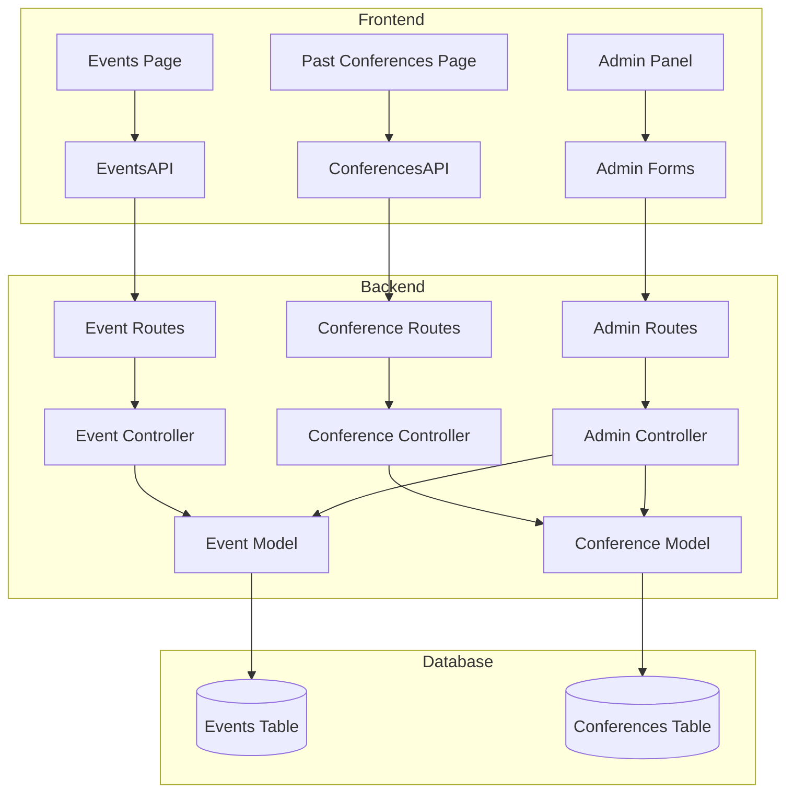

# Design Document

## Overview

本设计文档描述了如何为 GIIP 全栈应用实现基于时间的事件和会议分类功能。该功能将自动根据活动的开始和结束时间，将正在进行或即将开始的活动显示在 Events 页面，将已结束的活动显示在 Past Conferences 页面。

### 核心目标

1. 在数据库层面添加时间字段支持
2. 在后端 API 提供时间过滤查询
3. 在前端实现基于时间的内容分类显示
4. 在管理后台支持时间字段的编辑

### 设计原则

- 使用 UTC 时间存储，避免时区问题
- 后端负责时间逻辑判断，前端负责展示
- 保持向后兼容，支持没有结束时间的旧数据
- 最小化代码改动，复用现有架构

## Architecture

### 系统架构图



### 数据流

1. **创建/编辑流程**:
   - 管理员在后台表单输入开始时间和结束时间
   - 前端验证时间有效性（结束时间 > 开始时间）
   - 后端接收数据并存储到数据库（UTC 格式）

2. **查询流程**:
   - 前端请求 Events 数据时，传递 `status=active` 参数
   - 后端根据当前时间过滤，返回结束时间在未来的活动
   - 前端请求 Past Conferences 数据时，传递 `status=past` 参数
   - 后端返回结束时间在过去的活动

3. **显示流程**:
   - 前端接收数据后，将 UTC 时间转换为本地时区
   - 渲染到对应页面，显示格式化的时间信息

## Components and Interfaces

### 1. Database Schema Changes

#### Events Table 修改

```sql
-- 添加新字段
ALTER TABLE events 
ADD COLUMN start_date TIMESTAMP,
ADD COLUMN end_date TIMESTAMP;

-- 迁移现有数据：将 date 字段复制到 start_date
UPDATE events 
SET start_date = date::timestamp,
    end_date = (date + INTERVAL '1 day')::timestamp
WHERE start_date IS NULL;

-- 添加约束
ALTER TABLE events 
ALTER COLUMN start_date SET NOT NULL,
ADD CONSTRAINT check_events_dates CHECK (end_date IS NULL OR end_date >= start_date);

-- 添加索引
CREATE INDEX idx_events_end_date ON events(end_date);
CREATE INDEX idx_events_status ON events(end_date) WHERE end_date >= CURRENT_TIMESTAMP;
```

#### Conferences Table 修改

```sql
-- 添加新字段
ALTER TABLE conferences 
ADD COLUMN start_date TIMESTAMP,
ADD COLUMN end_date TIMESTAMP;

-- 添加约束
ALTER TABLE conferences 
ADD CONSTRAINT check_conferences_dates CHECK (end_date IS NULL OR end_date >= start_date);

-- 添加索引
CREATE INDEX idx_conferences_end_date ON conferences(end_date);
CREATE INDEX idx_conferences_status ON conferences(end_date) WHERE end_date >= CURRENT_TIMESTAMP;
```

### 2. Backend API Changes

#### Event API 接口扩展

**GET /api/events**

新增查询参数：
- `status`: 可选值 `active` | `past` | `all`（默认 `all`）
- `sortBy`: 可选值 `start_date` | `end_date` | `created_at`（默认 `start_date`）
- `sortOrder`: 可选值 `asc` | `desc`（默认 `desc`）

响应示例：
```json
{
  "success": true,
  "data": [
    {
      "id": 1,
      "title": "Innovation Workshop",
      "description": "...",
      "start_date": "2025-11-15T09:00:00Z",
      "end_date": "2025-11-15T17:00:00Z",
      "location": "Conference Hall A",
      "capacity": 100,
      "status": "active",
      "created_by": 1,
      "creator_email": "user@example.com",
      "created_at": "2025-10-15T10:00:00Z",
      "updated_at": "2025-10-15T10:00:00Z"
    }
  ],
  "pagination": {...}
}
```

#### Conference API 接口扩展

**GET /api/conferences**

新增查询参数：
- `status`: 可选值 `active` | `past` | `all`（默认 `all`）
- `sortBy`: 可选值 `start_date` | `end_date` | `created_at`（默认 `start_date`）
- `sortOrder`: 可选值 `asc` | `desc`（默认 `desc`）

响应示例：
```json
{
  "success": true,
  "data": [
    {
      "id": 1,
      "title": "Global Innovation Summit 2025",
      "description": "...",
      "start_date": "2025-10-15T08:00:00Z",
      "end_date": "2025-10-17T18:00:00Z",
      "date_range": "Oct 15-17, 2025",
      "location": "San Francisco, CA",
      "summary": "...",
      "status": "past",
      "created_by": 1,
      "creator_email": "user@example.com",
      "created_at": "2025-10-01T10:00:00Z",
      "updated_at": "2025-10-01T10:00:00Z"
    }
  ],
  "pagination": {...}
}
```

### 3. Frontend Components

#### EventsAPI 扩展

```javascript
const EventsAPI = {
  /**
   * Get active events (for Events page)
   * @param {Object} options - Query options
   * @returns {Promise<Object>}
   */
  async getActive(options = {}) {
    const params = new URLSearchParams({
      status: 'active',
      sortBy: 'start_date',
      sortOrder: 'asc',
      ...options
    });
    return ApiClient.get(`/events?${params}`);
  },

  /**
   * Get past events (for Past Conferences page)
   * @param {Object} options - Query options
   * @returns {Promise<Object>}
   */
  async getPast(options = {}) {
    const params = new URLSearchParams({
      status: 'past',
      sortBy: 'end_date',
      sortOrder: 'desc',
      ...options
    });
    return ApiClient.get(`/events?${params}`);
  }
};
```

#### ConferencesAPI 扩展

```javascript
const ConferencesAPI = {
  /**
   * Get active conferences (for Events page)
   * @param {Object} options - Query options
   * @returns {Promise<Object>}
   */
  async getActive(options = {}) {
    const params = new URLSearchParams({
      status: 'active',
      sortBy: 'start_date',
      sortOrder: 'asc',
      ...options
    });
    return ApiClient.get(`/conferences?${params}`);
  },

  /**
   * Get past conferences (for Past Conferences page)
   * @param {Object} options - Query options
   * @returns {Promise<Object>}
   */
  async getPast(options = {}) {
    const params = new URLSearchParams({
      status: 'past',
      sortBy: 'end_date',
      sortOrder: 'desc',
      ...options
    });
    return ApiClient.get(`/conferences?${params}`);
  }
};
```

#### EventsRenderer 更新

```javascript
const EventsRenderer = {
  /**
   * Render event item with time information
   */
  renderItem(event) {
    const startDate = new Date(event.start_date);
    const endDate = new Date(event.end_date);
    const isActive = endDate >= new Date();
    
    // Format dates for display
    const dateDisplay = this.formatDateRange(startDate, endDate);
    
    return `
      <article class="event-item ${isActive ? 'active' : 'past'}">
        <div class="event-date-badge">
          ${dateDisplay}
        </div>
        <div class="event-content">
          <h3>${event.title}</h3>
          <p>${event.description}</p>
          <span class="event-status">${isActive ? 'Upcoming' : 'Past'}</span>
        </div>
      </article>
    `;
  },

  /**
   * Fetch and render active events only
   */
  async render() {
    const container = document.querySelector('.events-list');
    if (!container) return;

    try {
      showLoading(container);
      
      // Fetch both active events and conferences
      const [eventsResponse, conferencesResponse] = await Promise.all([
        EventsAPI.getActive(),
        ConferencesAPI.getActive()
      ]);
      
      const allActiveItems = [
        ...(eventsResponse.data || []),
        ...(conferencesResponse.data || [])
      ].sort((a, b) => new Date(a.start_date) - new Date(b.start_date));
      
      if (allActiveItems.length === 0) {
        container.innerHTML = '<p>No upcoming events.</p>';
        return;
      }
      
      container.innerHTML = allActiveItems.map(item => this.renderItem(item)).join('');
    } catch (error) {
      showError(container, error.message);
    }
  }
};
```

#### ConferencesRenderer 更新

```javascript
const ConferencesRenderer = {
  /**
   * Render conference card with time information
   */
  renderCard(conference) {
    const startDate = new Date(conference.start_date);
    const endDate = new Date(conference.end_date);
    
    // Format dates for display
    const dateDisplay = this.formatDateRange(startDate, endDate);
    
    return `
      <div class="conference-card past">
        <div class="conference-img">
          
        </div>
        <div class="conference-content">
          <span class="conference-date">${dateDisplay}</span>
          <h3>${conference.title}</h3>
          <p>${conference.summary}</p>
        </div>
      </div>
    `;
  },

  /**
   * Fetch and render past conferences only
   */
  async render() {
    const slider = document.querySelector('.conferences-slider');
    if (!slider) return;

    try {
      showLoading(slider);
      
      // Fetch both past events and conferences
      const [eventsResponse, conferencesResponse] = await Promise.all([
        EventsAPI.getPast(),
        ConferencesAPI.getPast()
      ]);
      
      const allPastItems = [
        ...(eventsResponse.data || []),
        ...(conferencesResponse.data || [])
      ].sort((a, b) => new Date(b.end_date) - new Date(a.end_date));
      
      if (allPastItems.length === 0) {
        slider.innerHTML = '<p>No past conferences.</p>';
        return;
      }
      
      slider.innerHTML = allPastItems.map(item => this.renderCard(item)).join('');
    } catch (error) {
      showError(slider, error.message);
    }
  }
};
```

### 4. Admin Panel Updates

#### Event Form 字段

```html
<form id="eventForm">
  <input type="text" name="title" required>
  <textarea name="description" required></textarea>
  
  <!-- 新增时间字段 -->
  <div class="form-group">
    <label>Start Date & Time</label>
    <input type="datetime-local" name="start_date" required>
  </div>
  
  <div class="form-group">
    <label>End Date & Time</label>
    <input type="datetime-local" name="end_date" required>
  </div>
  
  <input type="text" name="location" required>
  <input type="number" name="capacity" min="1">
  
  <button type="submit">Save Event</button>
</form>
```

#### Conference Form 字段

```html
<form id="conferenceForm">
  <input type="text" name="title" required>
  <textarea name="description" required></textarea>
  
  <!-- 新增时间字段 -->
  <div class="form-group">
    <label>Start Date & Time</label>
    <input type="datetime-local" name="start_date" required>
  </div>
  
  <div class="form-group">
    <label>End Date & Time</label>
    <input type="datetime-local" name="end_date" required>
  </div>
  
  <input type="text" name="location" required>
  <textarea name="summary"></textarea>
  
  <button type="submit">Save Conference</button>
</form>
```

## Data Models

### Event Model

```javascript
{
  id: number,
  title: string,
  description: string,
  start_date: string (ISO 8601 UTC),
  end_date: string (ISO 8601 UTC),
  location: string,
  capacity: number,
  status: 'active' | 'past' (computed),
  created_by: number,
  creator_email: string,
  created_at: string (ISO 8601 UTC),
  updated_at: string (ISO 8601 UTC)
}
```

### Conference Model

```javascript
{
  id: number,
  title: string,
  description: string,
  start_date: string (ISO 8601 UTC),
  end_date: string (ISO 8601 UTC),
  date_range: string (deprecated, 保留向后兼容),
  location: string,
  summary: string,
  image_url: string,
  status: 'active' | 'past' (computed),
  created_by: number,
  creator_email: string,
  created_at: string (ISO 8601 UTC),
  updated_at: string (ISO 8601 UTC)
}
```

### Status Computation Logic

```javascript
// Backend computation
function computeStatus(endDate) {
  if (!endDate) return 'active'; // 没有结束时间视为活跃
  const now = new Date();
  const end = new Date(endDate);
  return end >= now ? 'active' : 'past';
}
```

## Error Handling

### 1. 时间验证错误

**场景**: 用户输入的结束时间早于开始时间

**处理**:
- 前端：表单验证，显示错误提示
- 后端：返回 400 Bad Request
```json
{
  "success": false,
  "error": {
    "code": "INVALID_DATE_RANGE",
    "message": "End date must be after start date"
  }
}
```

### 2. 缺失时间字段

**场景**: 旧数据没有 start_date 或 end_date

**处理**:
- 数据库迁移时自动填充默认值
- API 返回时，如果 end_date 为 null，视为 active 状态
- 前端显示时，使用 "TBD" 或 "Ongoing" 标识

### 3. 时区转换错误

**场景**: 时区转换导致显示错误

**处理**:
- 始终使用 UTC 存储
- 前端使用 `toLocaleString()` 自动转换为用户本地时区
- 提供时区信息显示（可选）

### 4. API 查询失败

**场景**: 网络错误或服务器错误

**处理**:
- 显示友好的错误消息
- 提供重试按钮
- 记录错误日志用于调试

## Testing Strategy

### 1. Unit Tests

#### Backend Tests

**Event Controller Tests**
```javascript
describe('Event Controller', () => {
  test('should filter active events correctly', async () => {
    const response = await request(app)
      .get('/api/events?status=active')
      .expect(200);
    
    response.body.data.forEach(event => {
      expect(new Date(event.end_date)).toBeGreaterThanOrEqual(new Date());
    });
  });

  test('should filter past events correctly', async () => {
    const response = await request(app)
      .get('/api/events?status=past')
      .expect(200);
    
    response.body.data.forEach(event => {
      expect(new Date(event.end_date)).toBeLessThan(new Date());
    });
  });

  test('should validate date range on create', async () => {
    const response = await request(app)
      .post('/api/events')
      .send({
        title: 'Test Event',
        start_date: '2025-11-20T10:00:00Z',
        end_date: '2025-11-19T10:00:00Z' // Invalid: before start
      })
      .expect(400);
    
    expect(response.body.error.code).toBe('INVALID_DATE_RANGE');
  });
});
```

**Conference Controller Tests**
```javascript
describe('Conference Controller', () => {
  test('should compute status correctly', () => {
    const activeConference = {
      end_date: new Date(Date.now() + 86400000).toISOString()
    };
    expect(computeStatus(activeConference.end_date)).toBe('active');

    const pastConference = {
      end_date: new Date(Date.now() - 86400000).toISOString()
    };
    expect(computeStatus(pastConference.end_date)).toBe('past');
  });

  test('should handle null end_date as active', () => {
    expect(computeStatus(null)).toBe('active');
  });
});
```

#### Frontend Tests

**EventsAPI Tests**
```javascript
describe('EventsAPI', () => {
  test('should fetch active events with correct params', async () => {
    const mockFetch = jest.fn().mockResolvedValue({
      ok: true,
      json: async () => ({ success: true, data: [] })
    });
    global.fetch = mockFetch;

    await EventsAPI.getActive();
    
    expect(mockFetch).toHaveBeenCalledWith(
      expect.stringContaining('status=active'),
      expect.any(Object)
    );
  });
});
```

### 2. Integration Tests

**End-to-End Flow Tests**
```javascript
describe('Event Time Classification E2E', () => {
  test('should create event and display in correct section', async () => {
    // 1. Create active event
    const eventData = {
      title: 'Future Event',
      start_date: new Date(Date.now() + 86400000).toISOString(),
      end_date: new Date(Date.now() + 172800000).toISOString(),
      location: 'Test Location',
      capacity: 50
    };
    
    const createResponse = await request(app)
      .post('/api/events')
      .send(eventData)
      .expect(201);
    
    // 2. Verify it appears in active events
    const activeResponse = await request(app)
      .get('/api/events?status=active')
      .expect(200);
    
    expect(activeResponse.body.data).toContainEqual(
      expect.objectContaining({ id: createResponse.body.data.id })
    );
    
    // 3. Verify it doesn't appear in past events
    const pastResponse = await request(app)
      .get('/api/events?status=past')
      .expect(200);
    
    expect(pastResponse.body.data).not.toContainEqual(
      expect.objectContaining({ id: createResponse.body.data.id })
    );
  });
});
```

### 3. Manual Testing Checklist

- [ ] 创建新事件，设置未来的结束时间，验证出现在 Events 页面
- [ ] 创建新事件，设置过去的结束时间，验证出现在 Past Conferences 页面
- [ ] 编辑现有事件，修改时间，验证页面分类更新
- [ ] 验证时间显示正确转换为本地时区
- [ ] 验证表单验证：结束时间必须晚于开始时间
- [ ] 验证旧数据（没有时间字段）的兼容性
- [ ] 验证 News 页面不受影响
- [ ] 验证排序功能正常工作
- [ ] 验证分页功能正常工作
- [ ] 验证移动端显示正常

## Implementation Notes

### 数据库迁移策略

1. **阶段 1**: 添加新字段（允许 NULL）
2. **阶段 2**: 迁移现有数据
3. **阶段 3**: 设置 NOT NULL 约束
4. **阶段 4**: 添加索引

### 向后兼容性

- 保留 `date` 字段（events 表）和 `date_range` 字段（conferences 表）
- API 同时返回新旧字段
- 前端优先使用新字段，回退到旧字段

### 性能优化

- 使用数据库索引加速时间查询
- 使用部分索引（partial index）优化常见查询
- 前端缓存 API 响应，减少重复请求
- 考虑使用 Redis 缓存活跃事件列表

### 安全考虑

- 验证时间输入，防止 SQL 注入
- 限制时间范围，防止异常数据
- 权限检查：只有管理员可以修改时间字段

## Design Decisions

### 为什么使用 TIMESTAMP 而不是 DATE？

- 需要精确到小时和分钟，支持跨时区的活动
- TIMESTAMP 自动处理时区转换
- 更灵活，支持未来扩展（如多天活动的精确时间）

### 为什么在后端计算 status 而不是前端？

- 确保数据一致性
- 减少前端逻辑复杂度
- 便于数据库查询和过滤
- 避免客户端时间不准确的问题

### 为什么 Events 和 Past Conferences 合并显示？

- 用户体验更好，一个页面看到所有活跃内容
- 减少页面数量，简化导航
- 符合用户心智模型：正在进行的 vs 已结束的

### 为什么保留 date_range 字段？

- 向后兼容现有数据
- 某些会议可能需要自定义日期显示格式
- 避免破坏现有功能
