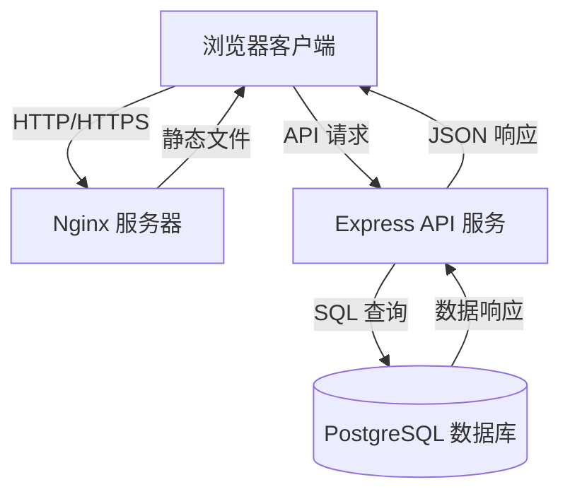
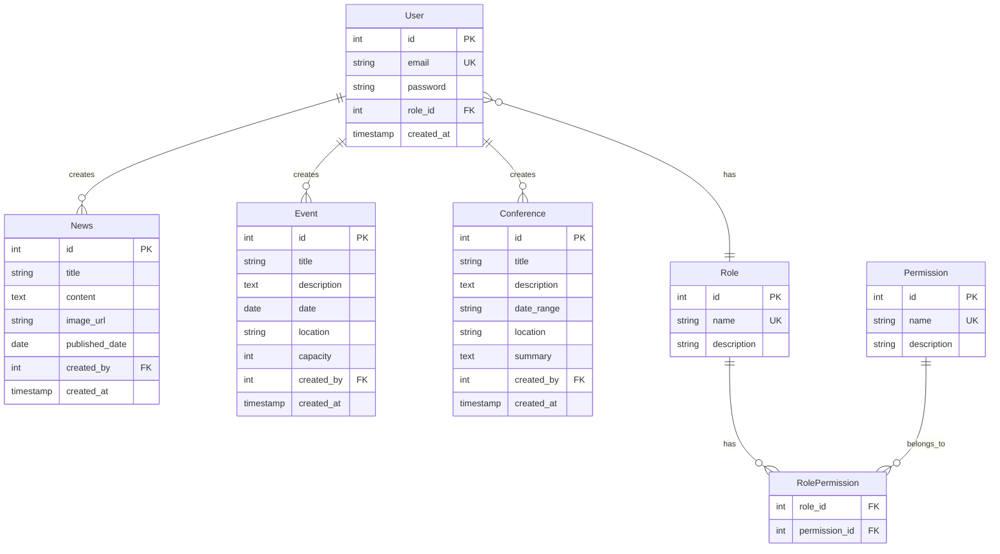
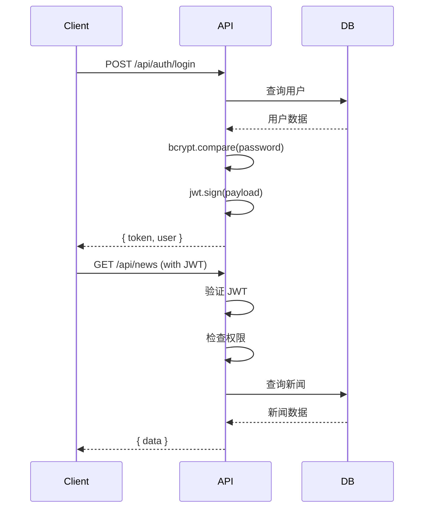

# 设计文档

## 概述

GIIP 全栈应用是一个现代化的 Web 平台,采用前后端分离架构。前端使用 Tailwind CSS 构建响应式界面,后端采用 Node.js + Express 提供 RESTful API,PostgreSQL 作为数据存储,整个系统通过 Docker 容器化部署。系统实现了完整的 RBAC 权限控制,支持新闻、活动、会议等内容管理功能。

### 技术栈

**前端:**
- Tailwind CSS v3.4+ (实用优先的 CSS 框架)
- Vanilla JavaScript (原生 JS,无框架依赖)
- Font Awesome 6.4.0 (图标库)

**后端:**
- Node.js v18+ (运行时环境)
- Express v4.18+ (Web 框架)
- PostgreSQL v16 (关系型数据库)
- pg (PostgreSQL 客户端)
- bcrypt (密码哈希)
- jsonwebtoken (JWT 认证)
- Zod (输入验证)
- Helmet.js (安全头)
- CORS (跨域资源共享)

**部署:**
- Docker & Docker Compose
- Nginx (前端静态文件服务)

## 架构

### 系统架构图



### 三层架构


1. **表示层 (Presentation Layer)**: 前端 HTML/CSS/JS,负责用户界面和交互
2. **业务逻辑层 (Business Logic Layer)**: Express API,处理业务规则、权限验证、数据处理
3. **数据访问层 (Data Access Layer)**: PostgreSQL 数据库,持久化存储

### 容器化架构

```yaml
services:
  web:      # Nginx 前端服务 (端口 80)
  api:      # Node.js API 服务 (端口 3000)
  db:       # PostgreSQL 数据库 (端口 5432)
```

## 组件和接口

### 前端组件

#### 1. 导航组件 (Navigation Component)
- **职责**: 提供网站导航,支持桌面和移动端
- **功能**:
  - 桌面端: 水平导航栏,悬停效果
  - 移动端: 汉堡菜单,侧边抽屉,遮罩层
- **交互**: 点击菜单按钮切换显示/隐藏

#### 2. 英雄区组件 (Hero Section Component)
- **职责**: 展示主标题和行动号召按钮
- **功能**: 背景图片,渐变遮罩,响应式文字大小
- **样式**: Tailwind 类实现渐变、间距、按钮样式

#### 3. 卡片滑块组件 (Card Slider Component)
- **职责**: 展示新闻和会议卡片
- **功能**:
  - 桌面端: 网格布局,悬停动画
  - 移动端: 水平滚动,自动轮播 (5秒),指示器
- **交互**: 触摸滑动,点击指示器切换

#### 4. 活动列表组件 (Events List Component)
- **职责**: 显示即将举行的活动
- **功能**: 日期徽章,活动详情,注册按钮
- **布局**: 桌面端水平排列,移动端垂直堆叠

#### 5. 返回顶部按钮 (Back to Top Button)
- **职责**: 快速返回页面顶部
- **功能**: 滚动超过 300px 显示,点击平滑滚动到顶部
- **样式**: 固定定位,圆形按钮,悬停动画

### 后端组件

#### 1. 认证中间件 (Auth Middleware)
```javascript
// authGuard: 验证 JWT token
// 输入: req.headers.authorization
// 输出: req.user (解码的用户信息)
// 错误: 401 Unauthorized
```

#### 2. 权限中间件 (Permission Middleware)
```javascript
// permissionGuard(permission): 检查用户权限
// 输入: req.user.role_id, required permission
// 输出: 继续执行或返回 403 Forbidden
```

#### 3. 控制器 (Controllers)
- **AuthController**: 处理注册、登录
- **NewsController**: CRUD 操作新闻
- **EventController**: CRUD 操作活动
- **ConferenceController**: CRUD 操作会议
- **AdminController**: 用户管理、角色管理

#### 4. 服务层 (Services)
- **UserService**: 用户业务逻辑
- **RoleService**: 角色和权限管理
- **ContentService**: 内容管理通用逻辑

#### 5. 数据访问层 (Repositories)
- **UserRepository**: 用户数据库操作
- **RoleRepository**: 角色数据库操作
- **NewsRepository**: 新闻数据库操作
- **EventRepository**: 活动数据库操作
- **ConferenceRepository**: 会议数据库操作

### API 接口规范

#### 认证接口

**POST /api/auth/register**
```json
Request:
{
  "email": "user@example.com",
  "password": "SecurePass123!"
}

Response (201):
{
  "success": true,
  "message": "User registered successfully",
  "userId": 1
}
```

**POST /api/auth/login**
```json
Request:
{
  "email": "user@example.com",
  "password": "SecurePass123!"
}

Response (200):
{
  "success": true,
  "token": "eyJhbGciOiJIUzI1NiIsInR5cCI6IkpXVCJ9...",
  "user": {
    "id": 1,
    "email": "user@example.com",
    "role": "user"
  }
}
```

#### 新闻接口

**GET /api/news**
```json
Response (200):
{
  "success": true,
  "data": [
    {
      "id": 1,
      "title": "Latest Innovation News",
      "content": "...",
      "image_url": "https://...",
      "published_date": "2025-10-15",
      "created_by": 1
    }
  ]
}
```

**POST /api/news** (需要 'write:news' 权限)
```json
Request:
{
  "title": "New Article",
  "content": "Article content...",
  "image_url": "https://...",
  "published_date": "2025-10-17"
}

Response (201):
{
  "success": true,
  "data": { "id": 2, ... }
}
```

**PUT /api/news/:id** (需要所有权或 'edit:news' 权限)
**DELETE /api/news/:id** (需要 'delete:news' 权限)

#### 活动和会议接口

类似的 CRUD 端点:
- GET /api/events
- POST /api/events
- PUT /api/events/:id
- DELETE /api/events/:id
- GET /api/conferences
- POST /api/conferences
- PUT /api/conferences/:id
- DELETE /api/conferences/:id

#### 管理员接口

**GET /api/admin/users** (仅 admin)
**PUT /api/admin/users/:id/role** (仅 admin)
**POST /api/admin/roles** (仅 admin)
**POST /api/admin/roles/:id/permissions** (仅 admin)

## 数据模型

### ER 图



### 数据库表结构

#### users 表
```sql
CREATE TABLE users (
    id SERIAL PRIMARY KEY,
    email VARCHAR(255) UNIQUE NOT NULL,
    password VARCHAR(255) NOT NULL,
    role_id INTEGER REFERENCES roles(id),
    created_at TIMESTAMP DEFAULT CURRENT_TIMESTAMP
);
```

#### roles 表
```sql
CREATE TABLE roles (
    id SERIAL PRIMARY KEY,
    name VARCHAR(50) UNIQUE NOT NULL,
    description TEXT
);
```

#### permissions 表
```sql
CREATE TABLE permissions (
    id SERIAL PRIMARY KEY,
    name VARCHAR(100) UNIQUE NOT NULL,
    description TEXT
);
```

#### role_permissions 表
```sql
CREATE TABLE role_permissions (
    role_id INTEGER REFERENCES roles(id) ON DELETE CASCADE,
    permission_id INTEGER REFERENCES permissions(id) ON DELETE CASCADE,
    PRIMARY KEY (role_id, permission_id)
);
```

#### news 表
```sql
CREATE TABLE news (
    id SERIAL PRIMARY KEY,
    title VARCHAR(255) NOT NULL,
    content TEXT NOT NULL,
    image_url VARCHAR(500),
    published_date DATE NOT NULL,
    created_by INTEGER REFERENCES users(id),
    created_at TIMESTAMP DEFAULT CURRENT_TIMESTAMP
);
```

#### events 表
```sql
CREATE TABLE events (
    id SERIAL PRIMARY KEY,
    title VARCHAR(255) NOT NULL,
    description TEXT NOT NULL,
    date DATE NOT NULL,
    location VARCHAR(255) NOT NULL,
    capacity INTEGER,
    created_by INTEGER REFERENCES users(id),
    created_at TIMESTAMP DEFAULT CURRENT_TIMESTAMP
);
```

#### conferences 表
```sql
CREATE TABLE conferences (
    id SERIAL PRIMARY KEY,
    title VARCHAR(255) NOT NULL,
    description TEXT NOT NULL,
    date_range VARCHAR(100) NOT NULL,
    location VARCHAR(255) NOT NULL,
    summary TEXT,
    created_by INTEGER REFERENCES users(id),
    created_at TIMESTAMP DEFAULT CURRENT_TIMESTAMP
);
```

### 权限映射

#### Admin 角色权限
- read:news, write:news, edit:news, delete:news
- read:events, write:events, edit:events, delete:events
- read:conferences, write:conferences, edit:conferences, delete:conferences
- manage:users, manage:roles

#### Editor 角色权限
- read:news, write:news, edit:news
- read:events, write:events, edit:events
- read:conferences, write:conferences, edit:conferences

#### User 角色权限
- read:news
- read:events
- read:conferences

## 错误处理

### 错误响应格式

```json
{
  "success": false,
  "error": {
    "code": "VALIDATION_ERROR",
    "message": "Invalid email format",
    "details": [
      {
        "field": "email",
        "message": "Must be a valid email address"
      }
    ]
  }
}
```

### HTTP 状态码使用

- **200 OK**: 成功的 GET, PUT 请求
- **201 Created**: 成功的 POST 请求
- **204 No Content**: 成功的 DELETE 请求
- **400 Bad Request**: 客户端输入验证失败
- **401 Unauthorized**: 未提供或无效的 JWT
- **403 Forbidden**: 权限不足
- **404 Not Found**: 资源不存在
- **409 Conflict**: 资源冲突 (如邮箱已存在)
- **500 Internal Server Error**: 服务器错误

### 错误处理中间件

```javascript
// 全局错误处理器
app.use((err, req, res, next) => {
  console.error(err.stack);
  
  if (err.name === 'ValidationError') {
    return res.status(400).json({
      success: false,
      error: {
        code: 'VALIDATION_ERROR',
        message: err.message,
        details: err.details
      }
    });
  }
  
  if (err.name === 'UnauthorizedError') {
    return res.status(401).json({
      success: false,
      error: {
        code: 'UNAUTHORIZED',
        message: 'Invalid or expired token'
      }
    });
  }
  
  res.status(500).json({
    success: false,
    error: {
      code: 'INTERNAL_ERROR',
      message: 'An unexpected error occurred'
    }
  });
});
```

## 测试策略

### 前端测试

#### 单元测试
- 测试工具: Jest (可选)
- 测试范围: 工具函数,数据验证

#### 集成测试
- 测试 API 调用和响应处理
- 模拟不同的 API 响应场景

#### 手动测试
- 跨浏览器测试 (Chrome, Firefox, Safari, Edge)
- 响应式测试 (桌面、平板、手机)
- 交互测试 (导航、滑块、表单)

### 后端测试

#### 单元测试
- 测试工具: Jest + Supertest
- 测试范围:
  - 中间件函数 (authGuard, permissionGuard)
  - 服务层业务逻辑
  - 数据验证函数

#### 集成测试
- API 端点测试
- 数据库操作测试
- 权限验证测试

#### 测试数据库
- 使用独立的测试数据库
- 每次测试前重置数据库状态

### 测试覆盖目标

- 核心业务逻辑: 80%+ 覆盖率
- API 端点: 100% 覆盖率
- 权限验证: 100% 覆盖率

## 安全设计

### 认证流程



### 安全措施

1. **密码安全**
   - bcrypt 哈希,salt rounds = 10
   - 密码强度要求: 最少 8 字符,包含大小写字母和数字

2. **JWT 安全**
   - 使用强随机密钥 (至少 256 位)
   - 设置合理的过期时间 (1 小时)
   - 在 HTTP-only cookie 中存储 (可选)

3. **输入验证**
   - 使用 Zod schema 验证所有输入
   - 防止 SQL 注入: 使用参数化查询
   - 防止 XSS: 转义用户输入

4. **HTTP 安全头**
   ```javascript
   helmet({
     contentSecurityPolicy: {
       directives: {
         defaultSrc: ["'self'"],
         styleSrc: ["'self'", "'unsafe-inline'", "https://cdnjs.cloudflare.com"],
         scriptSrc: ["'self'"],
         imgSrc: ["'self'", "https:", "data:"]
       }
     }
   })
   ```

5. **CORS 配置**
   ```javascript
   cors({
     origin: process.env.FRONTEND_URL || 'http://localhost',
     credentials: true
   })
   ```

6. **速率限制**
   - 登录端点: 5 次/15 分钟
   - API 端点: 100 次/15 分钟

## 部署架构

### Docker Compose 配置

```yaml
version: '3.8'

services:
  web:
    build:
      context: ./frontend
      dockerfile: Dockerfile
    ports:
      - "80:80"
    depends_on:
      - api
    networks:
      - giip-network

  api:
    build:
      context: ./backend
      dockerfile: Dockerfile
    ports:
      - "3000:3000"
    environment:
      - NODE_ENV=production
      - DB_HOST=db
      - DB_PORT=5432
      - DB_NAME=${DB_NAME}
      - DB_USER=${DB_USER}
      - DB_PASSWORD=${DB_PASSWORD}
      - JWT_SECRET=${JWT_SECRET}
    depends_on:
      db:
        condition: service_healthy
    networks:
      - giip-network

  db:
    image: postgres:16-alpine
    environment:
      - POSTGRES_DB=${DB_NAME}
      - POSTGRES_USER=${DB_USER}
      - POSTGRES_PASSWORD=${DB_PASSWORD}
    volumes:
      - postgres-data:/var/lib/postgresql/data
      - ./backend/schema.sql:/docker-entrypoint-initdb.d/1-schema.sql
      - ./backend/seeds/seed.sql:/docker-entrypoint-initdb.d/2-seed.sql
    healthcheck:
      test: ["CMD-SHELL", "pg_isready -U ${DB_USER}"]
      interval: 10s
      timeout: 5s
      retries: 5
    networks:
      - giip-network

volumes:
  postgres-data:

networks:
  giip-network:
    driver: bridge
```

### 环境变量

**.env.example**
```env
# Database
DB_NAME=giip_db
DB_USER=giip_user
DB_PASSWORD=secure_password_here
DB_HOST=localhost
DB_PORT=5432

# JWT
JWT_SECRET=your_jwt_secret_key_min_256_bits
JWT_EXPIRES_IN=1h

# Frontend
FRONTEND_URL=http://localhost

# Node
NODE_ENV=development
PORT=3000
```

### 健康检查

- **API 健康检查**: GET /api/health
- **数据库健康检查**: pg_isready
- **前端健康检查**: Nginx 状态页

## 性能优化

### 前端优化

1. **CSS 优化**
   - 使用 Tailwind 的 JIT 模式
   - 生产环境移除未使用的样式

2. **JavaScript 优化**
   - 最小化和压缩 JS 文件
   - 使用防抖 (debounce) 处理滚动事件

3. **图片优化**
   - 使用 WebP 格式
   - 实现懒加载

4. **缓存策略**
   - 静态资源设置长期缓存
   - API 响应使用 ETag

### 后端优化

1. **数据库优化**
   - 为常用查询字段添加索引
   - 使用连接池管理数据库连接

2. **查询优化**
   - 避免 N+1 查询问题
   - 使用分页限制返回数据量

3. **缓存策略**
   - Redis 缓存热点数据 (可选)
   - 内存缓存权限映射

## 可扩展性设计

### 水平扩展

- API 服务无状态设计,支持多实例部署
- 使用负载均衡器分发请求
- 数据库读写分离 (主从复制)

### 功能扩展

- 模块化设计,易于添加新的内容类型
- 插件式权限系统,支持自定义权限
- RESTful API 设计,便于第三方集成

### 未来增强

- 实时通知系统 (WebSocket)
- 文件上传服务 (S3 兼容)
- 全文搜索 (Elasticsearch)
- 多语言支持 (i18n)
- 数据分析仪表板
