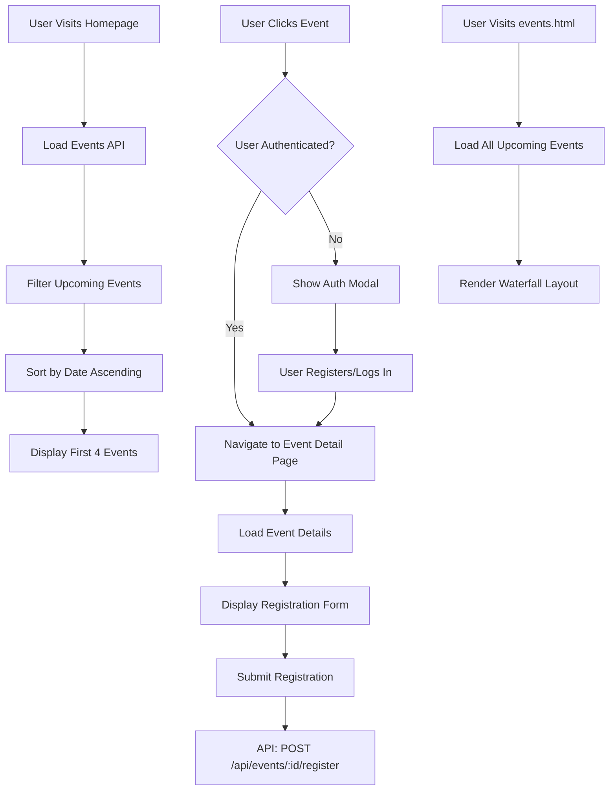

# Design Document

## Overview

This design implements a comprehensive upcoming events display system for the GIIP frontend. The system consists of three main components: a homepage section displaying the four most recent upcoming events, a dedicated events page with a waterfall layout for all events, and individual event detail pages with registration forms. The design follows the reference layout with circular date badges, clean typography, and authentication-gated access to registration functionality.

The implementation leverages the existing backend API (`/api/events`), authentication system, and design patterns established in the codebase. The visual design matches the "Past Conferences" section style while adapting it for upcoming events with enhanced interactivity.

## Architecture

### Component Structure

```
Frontend Components:
├── Homepage Upcoming Events Section
│   ├── Section Header (matching Past Conferences style)
│   ├── Event Cards (4 items, grid layout)
│   └── "Learn More" link to events.html
├── Events Page (events.html)
│   ├── Page Header
│   ├── Waterfall Layout Container
│   └── Event Cards (all upcoming events)
├── Event Detail Page (event-detail.html)
│   ├── Event Header with Date Badge
│   ├── Event Information Section
│   ├── Registration Form (auth-gated)
│   └── Related Events Sidebar
└── Shared Components
    ├── Event Card Component
    ├── Date Badge Component
    └── Registration Modal
```

### Data Flow



## Components and Interfaces

### 1. Event Card Component

**Purpose**: Reusable card component for displaying event information

**HTML Structure**:
```html
<div class="event-card">
  <div class="event-date-badge">
    <span class="badge-year">2025</span>
    <span class="badge-date">Jun.13</span>
  </div>
  <div class="event-content">
    <h3 class="event-title">Event Title</h3>
    <p class="event-description">Event description text...</p>
  </div>
  <button class="event-action-btn" data-event-id="123">
    <span>→</span>
  </button>
</div>
```

**CSS Styling** (following reference design):
```css
.event-card {
  display: flex;
  align-items: center;
  gap: 1.5rem;
  padding: 1.5rem;
  background: linear-gradient(135deg, #f8f9fa 0%, #ffffff 100%);
  border-radius: 8px;
  transition: transform 0.3s ease, box-shadow 0.3s ease;
}

.event-card:hover {
  transform: translateY(-4px);
  box-shadow: 0 8px 24px rgba(0, 0, 0, 0.12);
}

.event-date-badge {
  flex-shrink: 0;
  width: 70px;
  height: 70px;
  border-radius: 50%;
  background: linear-gradient(135deg, #FF8C42 0%, #FF6B35 100%);
  display: flex;
  flex-direction: column;
  align-items: center;
  justify-content: center;
  color: white;
  font-weight: 600;
}

.badge-year {
  font-size: 0.75rem;
  line-height: 1;
}

.badge-date {
  font-size: 0.875rem;
  line-height: 1;
  margin-top: 2px;
}

.event-content {
  flex: 1;
  min-width: 0;
}

.event-title {
  font-size: 1.125rem;
  font-weight: 600;
  color: #333;
  margin-bottom: 0.5rem;
  line-height: 1.4;
}

.event-description {
  font-size: 0.9375rem;
  color: #666;
  line-height: 1.6;
  display: -webkit-box;
  -webkit-line-clamp: 2;
  -webkit-box-orient: vertical;
  overflow: hidden;
}

.event-action-btn {
  flex-shrink: 0;
  width: 48px;
  height: 48px;
  border-radius: 8px;
  background: #1B4D89;
  color: white;
  border: none;
  cursor: pointer;
  display: flex;
  align-items: center;
  justify-content: center;
  font-size: 1.5rem;
  transition: background 0.3s ease;
}

.event-action-btn:hover {
  background: #153a6b;
}
```

**JavaScript Interface**:
```javascript
class EventCard {
  constructor(eventData) {
    this.id = eventData.id;
    this.title = eventData.title;
    this.description = eventData.description;
    this.startDate = new Date(eventData.start_date);
    this.location = eventData.location;
  }
  
  render() {
    // Returns HTML string for the card
  }
  
  formatDate() {
    // Returns formatted date object { year, monthDay }
  }
  
  attachEventListeners() {
    // Attaches click handler for navigation
  }
}
```

### 2. Homepage Upcoming Events Section

**Location**: `frontend/index.html` (after Past Conferences section)

**HTML Structure**:
```html
<section id="upcoming-events" class="py-16 bg-white">
  <div class="container mx-auto px-6">
    <div class="section-title text-center mb-12">
      <h2 class="text-3xl font-semibold text-dark-gray mb-4">Upcoming Events</h2>
      <p class="text-text max-w-2xl mx-auto">
        Join us for upcoming lectures, seminars, and workshops on innovation and intellectual property
      </p>
    </div>
    
    <div id="upcoming-events-grid" class="grid grid-cols-1 md:grid-cols-2 gap-6 mb-8">
      <!-- Event cards will be dynamically inserted here -->
    </div>
    
    <div class="text-center">
      <a href="/events.html" class="inline-flex items-center text-primary-dark font-semibold hover:text-primary transition">
        Learn More <i class="fas fa-arrow-right ml-2"></i>
      </a>
    </div>
  </div>
</section>
```

**JavaScript Module** (`frontend/js/upcoming-events.js`):
```javascript
import { EventsAPI } from './api-client.js';
import { EventCard } from './components/event-card.js';

class UpcomingEventsSection {
  constructor() {
    this.container = document.getElementById('upcoming-events-grid');
    this.maxEvents = 4;
  }
  
  async init() {
    await this.loadEvents();
  }
  
  async loadEvents() {
    try {
      const response = await EventsAPI.getEvents({
        status: 'active',
        sortBy: 'start_date',
        sortOrder: 'asc',
        limit: this.maxEvents
      });
      
      this.renderEvents(response.data);
    } catch (error) {
      console.error('Failed to load upcoming events:', error);
      this.showError();
    }
  }
  
  renderEvents(events) {
    // Filter only future events
    const upcomingEvents = events.filter(event => 
      new Date(event.start_date) > new Date()
    );
    
    if (upcomingEvents.length === 0) {
      this.showNoEvents();
      return;
    }
    
    this.container.innerHTML = upcomingEvents
      .map(event => new EventCard(event).render())
      .join('');
    
    this.attachEventListeners();
  }
  
  attachEventListeners() {
    // Attach click handlers to all event cards
  }
}
```

### 3. Events Page (events.html)

**Purpose**: Display all upcoming events in a waterfall/masonry layout

**HTML Structure**:
```html
<!DOCTYPE html>
<html lang="en">
<head>
  <meta charset="UTF-8">
  <meta name="viewport" content="width=device-width, initial-scale=1.0">
  <title>Upcoming Events - GIIP</title>
  <!-- Same head includes as index.html -->
</head>
<body>
  <!-- Same header/navigation as index.html -->
  
  <main id="main-content">
    <section class="py-16 bg-gray-50">
      <div class="container mx-auto px-6">
        <div class="section-title text-center mb-12">
          <h1 class="text-4xl font-bold text-dark-gray mb-4">Upcoming Events</h1>
          <p class="text-text max-w-3xl mx-auto">
            Explore all our upcoming lectures, seminars, and conferences
          </p>
        </div>
        
        <!-- Filter/Sort Controls -->
        <div class="flex justify-between items-center mb-8">
          <div class="text-text">
            <span id="event-count">0</span> events found
          </div>
          <div class="flex gap-4">
            <select id="sort-select" class="px-4 py-2 border rounded">
              <option value="date-asc">Date (Earliest First)</option>
              <option value="date-desc">Date (Latest First)</option>
              <option value="title-asc">Title (A-Z)</option>
            </select>
          </div>
        </div>
        
        <!-- Waterfall Layout Container -->
        <div id="events-waterfall" class="masonry-grid">
          <!-- Event cards will be dynamically inserted -->
        </div>
        
        <!-- Loading State -->
        <div id="loading-state" class="text-center py-12">
          <i class="fas fa-spinner fa-spin text-4xl text-primary"></i>
          <p class="mt-4 text-text">Loading events...</p>
        </div>
        
        <!-- Empty State -->
        <div id="empty-state" class="text-center py-12 hidden">
          <i class="fas fa-calendar-times text-6xl text-gray-400 mb-4"></i>
          <h3 class="text-xl font-semibold text-dark-gray mb-2">No Upcoming Events</h3>
          <p class="text-text">Check back soon for new events and opportunities</p>
        </div>
      </div>
    </section>
  </main>
  
  <!-- Same footer as index.html -->
</body>
</html>
```

**CSS for Waterfall Layout**:
```css
.masonry-grid {
  display: grid;
  grid-template-columns: repeat(auto-fill, minmax(300px, 1fr));
  grid-auto-rows: 20px;
  gap: 1.5rem;
}

.masonry-grid .event-card {
  grid-row-end: span var(--row-span);
}

/* Responsive adjustments */
@media (min-width: 768px) {
  .masonry-grid {
    grid-template-columns: repeat(2, 1fr);
  }
}

@media (min-width: 1024px) {
  .masonry-grid {
    grid-template-columns: repeat(3, 1fr);
  }
}

@media (min-width: 1280px) {
  .masonry-grid {
    grid-template-columns: repeat(4, 1fr);
  }
}
```

**JavaScript Module** (`frontend/js/events-page.js`):
```javascript
class EventsPage {
  constructor() {
    this.container = document.getElementById('events-waterfall');
    this.loadingState = document.getElementById('loading-state');
    this.emptyState = document.getElementById('empty-state');
    this.sortSelect = document.getElementById('sort-select');
    this.events = [];
  }
  
  async init() {
    this.attachEventListeners();
    await this.loadAllEvents();
  }
  
  async loadAllEvents() {
    try {
      this.showLoading();
      const response = await EventsAPI.getEvents({
        status: 'active',
        sortBy: 'start_date',
        sortOrder: 'asc',
        limit: 100
      });
      
      this.events = response.data.filter(event => 
        new Date(event.start_date) > new Date()
      );
      
      this.renderEvents();
    } catch (error) {
      console.error('Failed to load events:', error);
      this.showError();
    }
  }
  
  renderEvents() {
    this.hideLoading();
    
    if (this.events.length === 0) {
      this.showEmpty();
      return;
    }
    
    this.container.innerHTML = this.events
      .map(event => this.createEventCard(event))
      .join('');
    
    this.calculateMasonrySpans();
    this.attachCardListeners();
  }
  
  calculateMasonrySpans() {
    // Calculate grid-row-end span for each card based on content height
    const cards = this.container.querySelectorAll('.event-card');
    cards.forEach(card => {
      const height = card.offsetHeight;
      const rowSpan = Math.ceil(height / 20);
      card.style.setProperty('--row-span', rowSpan);
    });
  }
}
```

### 4. Event Detail Page (event-detail.html)

**Purpose**: Display full event information and registration form

**URL Pattern**: `/event-detail.html?id={eventId}`

**HTML Structure**:
```html
<!DOCTYPE html>
<html lang="en">
<head>
  <meta charset="UTF-8">
  <meta name="viewport" content="width=device-width, initial-scale=1.0">
  <title id="page-title">Event Details - GIIP</title>
  <!-- Same head includes -->
</head>
<body>
  <!-- Same header/navigation -->
  
  <main id="main-content">
    <!-- Event Hero Section -->
    <section class="py-12 bg-gradient-to-br from-primary-dark to-primary">
      <div class="container mx-auto px-6">
        <div class="flex items-center gap-6 text-white">
          <div class="event-date-badge-large">
            <span class="badge-year" id="hero-year">2025</span>
            <span class="badge-date" id="hero-date">Jun.13</span>
          </div>
          <div>
            <h1 id="event-title" class="text-4xl font-bold mb-2"></h1>
            <div class="flex items-center gap-4 text-lg">
              <span id="event-time"><i class="far fa-clock mr-2"></i></span>
              <span id="event-location"><i class="fas fa-map-marker-alt mr-2"></i></span>
            </div>
          </div>
        </div>
      </div>
    </section>
    
    <!-- Event Content -->
    <section class="py-12">
      <div class="container mx-auto px-6">
        <div class="grid grid-cols-1 lg:grid-cols-3 gap-8">
          <!-- Main Content -->
          <div class="lg:col-span-2">
            <div class="bg-white rounded-lg shadow-md p-8 mb-8">
              <h2 class="text-2xl font-semibold mb-4">About This Event</h2>
              <div id="event-description" class="prose max-w-none"></div>
            </div>
            
            <!-- Registration Form (Auth-gated) -->
            <div id="registration-section" class="bg-white rounded-lg shadow-md p-8">
              <h2 class="text-2xl font-semibold mb-6">Register for This Event</h2>
              <form id="registration-form">
                <div class="grid grid-cols-1 md:grid-cols-2 gap-4 mb-4">
                  <div>
                    <label class="block text-sm font-medium mb-2">Full Name</label>
                    <input type="text" id="reg-name" class="w-full px-4 py-2 border rounded" readonly>
                  </div>
                  <div>
                    <label class="block text-sm font-medium mb-2">Email</label>
                    <input type="email" id="reg-email" class="w-full px-4 py-2 border rounded" readonly>
                  </div>
                </div>
                <div class="mb-4">
                  <label class="block text-sm font-medium mb-2">Organization</label>
                  <input type="text" id="reg-organization" class="w-full px-4 py-2 border rounded">
                </div>
                <div class="mb-4">
                  <label class="block text-sm font-medium mb-2">Additional Notes</label>
                  <textarea id="reg-notes" rows="4" class="w-full px-4 py-2 border rounded"></textarea>
                </div>
                <button type="submit" class="w-full bg-primary hover:bg-primary-dark text-white font-semibold py-3 rounded transition">
                  Submit Registration
                </button>
              </form>
            </div>
            
            <!-- Auth Required Message (for non-logged-in users) -->
            <div id="auth-required" class="bg-white rounded-lg shadow-md p-8 hidden">
              <div class="text-center">
                <i class="fas fa-lock text-6xl text-gray-400 mb-4"></i>
                <h3 class="text-xl font-semibold mb-2">Registration Required</h3>
                <p class="text-text mb-6">Please log in or create an account to register for this event</p>
                <div class="flex gap-4 justify-center">
                  <button id="show-login" class="bg-primary hover:bg-primary-dark text-white px-6 py-3 rounded transition">
                    Log In
                  </button>
                  <button id="show-register" class="bg-accent hover:bg-red-700 text-white px-6 py-3 rounded transition">
                    Create Account
                  </button>
                </div>
              </div>
            </div>
          </div>
          
          <!-- Sidebar -->
          <div class="lg:col-span-1">
            <div class="bg-white rounded-lg shadow-md p-6 mb-6">
              <h3 class="text-lg font-semibold mb-4">Event Details</h3>
              <div class="space-y-3">
                <div>
                  <span class="text-sm font-medium text-gray-600">Date</span>
                  <p id="sidebar-date" class="text-dark-gray"></p>
                </div>
                <div>
                  <span class="text-sm font-medium text-gray-600">Time</span>
                  <p id="sidebar-time" class="text-dark-gray"></p>
                </div>
                <div>
                  <span class="text-sm font-medium text-gray-600">Location</span>
                  <p id="sidebar-location" class="text-dark-gray"></p>
                </div>
                <div>
                  <span class="text-sm font-medium text-gray-600">Capacity</span>
                  <p id="sidebar-capacity" class="text-dark-gray"></p>
                </div>
              </div>
            </div>
            
            <!-- Related Events -->
            <div class="bg-white rounded-lg shadow-md p-6">
              <h3 class="text-lg font-semibold mb-4">Related Events</h3>
              <div id="related-events" class="space-y-4">
                <!-- Related event cards -->
              </div>
            </div>
          </div>
        </div>
      </div>
    </section>
  </main>
  
  <!-- Same footer -->
</body>
</html>
```

**JavaScript Module** (`frontend/js/event-detail.js`):
```javascript
class EventDetailPage {
  constructor() {
    this.eventId = this.getEventIdFromURL();
    this.authManager = new AuthManager();
    this.event = null;
  }
  
  async init() {
    await this.loadEventDetails();
    this.checkAuthAndShowForm();
    this.attachEventListeners();
  }
  
  getEventIdFromURL() {
    const params = new URLSearchParams(window.location.search);
    return params.get('id');
  }
  
  async loadEventDetails() {
    try {
      const response = await EventsAPI.getEvent(this.eventId);
      this.event = response.data;
      this.renderEventDetails();
    } catch (error) {
      console.error('Failed to load event:', error);
      this.showError();
    }
  }
  
  checkAuthAndShowForm() {
    if (this.authManager.isAuthenticated()) {
      this.showRegistrationForm();
    } else {
      this.showAuthRequired();
    }
  }
  
  showRegistrationForm() {
    document.getElementById('registration-section').classList.remove('hidden');
    document.getElementById('auth-required').classList.add('hidden');
    this.prefillUserData();
  }
  
  showAuthRequired() {
    document.getElementById('registration-section').classList.add('hidden');
    document.getElementById('auth-required').classList.remove('hidden');
  }
  
  async handleRegistration(e) {
    e.preventDefault();
    // Submit registration to backend
  }
}
```

## Data Models

### Event Data Model (Frontend)

```typescript
interface Event {
  id: number;
  title: string;
  description: string;
  start_date: string; // ISO 8601 format
  end_date: string;   // ISO 8601 format
  location: string;
  capacity: number;
  status: 'active' | 'past';
  created_by: number;
  creator_email: string;
  created_at: string;
  updated_at: string;
}

interface EventRegistration {
  event_id: number;
  user_id: number;
  organization?: string;
  notes?: string;
  registered_at: string;
}
```

### API Response Formats

**GET /api/events (Upcoming Events)**
```json
{
  "success": true,
  "data": [
    {
      "id": 1,
      "title": "Information Management and Business Intelligence Lecture",
      "description": "Artificial Intelligence, Information, and Organizational Innovation",
      "start_date": "2025-06-13T09:00:00Z",
      "end_date": "2025-06-13T17:00:00Z",
      "location": "Conference Hall A",
      "capacity": 100,
      "status": "active"
    }
  ],
  "pagination": {
    "page": 1,
    "limit": 4,
    "totalCount": 12,
    "totalPages": 3
  }
}
```

## Error Handling

### Error Scenarios and Responses

1. **API Request Failures**
   - Display user-friendly error message
   - Provide retry button
   - Log error details to console

2. **No Upcoming Events**
   - Show empty state with appropriate messaging
   - Suggest checking back later or viewing past conferences

3. **Authentication Failures**
   - Redirect to login modal
   - Preserve intended destination (event detail page)
   - Show clear messaging about why authentication is required

4. **Registration Submission Errors**
   - Display inline error messages
   - Highlight problematic fields
   - Preserve form data for retry

### Error Display Component

```javascript
class ErrorHandler {
  static showError(container, message, options = {}) {
    const errorHTML = `
      <div class="error-message bg-red-50 border border-red-200 rounded-lg p-6 text-center">
        <i class="fas fa-exclamation-circle text-4xl text-red-500 mb-3"></i>
        <h3 class="text-lg font-semibold text-red-800 mb-2">
          ${options.title || 'Something Went Wrong'}
        </h3>
        <p class="text-red-700 mb-4">${message}</p>
        ${options.retry ? `
          <button class="retry-btn bg-red-600 hover:bg-red-700 text-white px-6 py-2 rounded transition">
            Try Again
          </button>
        ` : ''}
      </div>
    `;
    container.innerHTML = errorHTML;
  }
}
```

## Testing Strategy

### Unit Tests

1. **Event Card Component**
   - Test date formatting logic
   - Test rendering with various event data
   - Test click handler attachment

2. **Data Filtering**
   - Test filtering of past vs. upcoming events
   - Test sorting by date
   - Test limiting to 4 events on homepage

3. **Authentication Gate**
   - Test authenticated user flow
   - Test non-authenticated user flow
   - Test redirect after login

### Integration Tests

1. **Homepage Events Section**
   - Test API integration
   - Test rendering of 4 events
   - Test "Learn More" link navigation

2. **Events Page**
   - Test loading all events
   - Test waterfall layout rendering
   - Test responsive behavior

3. **Event Detail Page**
   - Test event loading by ID
   - Test registration form display
   - Test form submission

### End-to-End Tests

1. **User Journey: Browse and Register**
   - Visit homepage
   - Click on event
   - Log in (if needed)
   - Complete registration
   - Verify confirmation

2. **User Journey: View All Events**
   - Visit homepage
   - Click "Learn More"
   - Browse events page
   - Filter/sort events
   - Click on specific event

### Manual Testing Checklist

- [ ] Visual comparison with reference design
- [ ] Responsive behavior on mobile, tablet, desktop
- [ ] Date badge displays correctly
- [ ] Authentication gate works properly
- [ ] Registration form submits successfully
- [ ] Error states display appropriately
- [ ] Loading states show during API calls
- [ ] Empty states display when no events
- [ ] Accessibility (keyboard navigation, screen readers)
- [ ] Cross-browser compatibility

## Design Decisions and Rationales

### 1. Waterfall Layout vs. Simple Grid

**Decision**: Use CSS Grid with auto-placement for waterfall effect

**Rationale**: 
- Pure CSS solution, no JavaScript library needed
- Better performance than JavaScript-based masonry
- Responsive by default
- Easier to maintain

### 2. Separate Events Page vs. Infinite Scroll on Homepage

**Decision**: Create dedicated events.html page

**Rationale**:
- Keeps homepage focused and fast-loading
- Better SEO with dedicated page
- Easier to implement filtering/sorting
- Matches user expectation from "Learn More" link

### 3. Modal vs. Redirect for Authentication

**Decision**: Use modal for authentication prompt

**Rationale**:
- Better user experience (no page reload)
- Preserves context (user stays on event page)
- Consistent with existing auth.js implementation
- Faster interaction

### 4. Pre-populate Registration Form vs. Empty Form

**Decision**: Pre-populate with user data from session

**Rationale**:
- Reduces friction in registration process
- Fewer errors from manual entry
- Faster completion time
- Better user experience

### 5. Client-side Date Filtering vs. Server-side

**Decision**: Use server-side filtering with `status: 'active'` parameter

**Rationale**:
- More efficient (less data transferred)
- Consistent with existing API design
- Reduces client-side processing
- Better for pagination

### 6. Circular Date Badge Design

**Decision**: Use circular badge matching reference design

**Rationale**:
- Visually distinctive and eye-catching
- Matches provided reference image
- Creates visual hierarchy
- Consistent with modern design trends

## Implementation Notes

### Dependencies

- Existing: Tailwind CSS, Font Awesome, auth.js, api-client.js
- New: event-card.js, upcoming-events.js, events-page.js, event-detail.js

### Browser Support

- Modern browsers (Chrome, Firefox, Safari, Edge)
- CSS Grid support required
- ES6+ JavaScript features

### Performance Considerations

- Lazy load images in event cards
- Implement pagination for events page if >50 events
- Cache API responses for 5 minutes
- Optimize waterfall layout calculations

### Accessibility

- ARIA labels on all interactive elements
- Keyboard navigation support
- Focus management in modals
- Screen reader announcements for dynamic content
- Sufficient color contrast ratios
- Semantic HTML structure
