# RBAC 权限系统流程图

## 认证流程

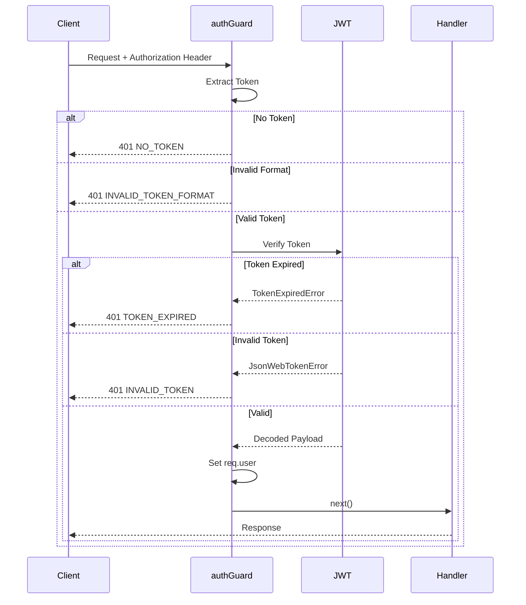

## 权限验证流程

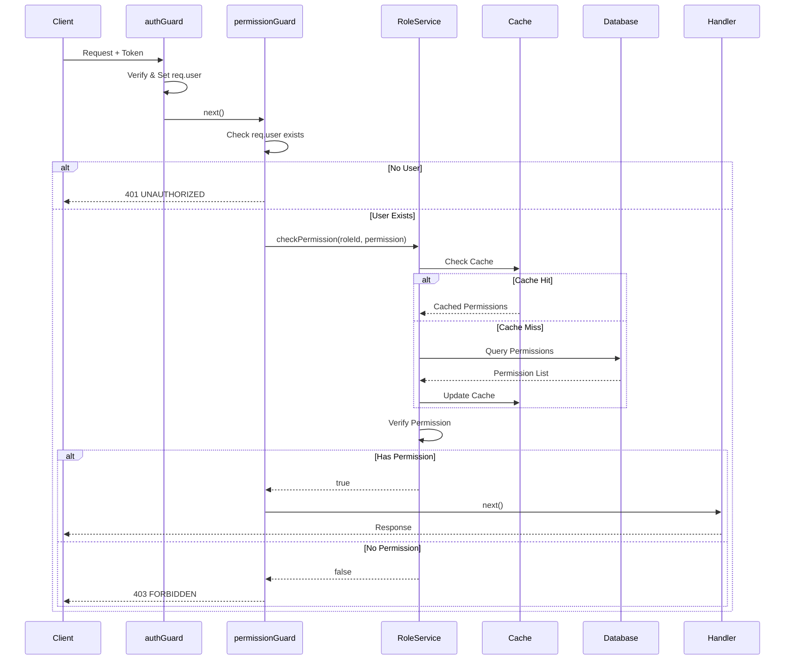

## 完整请求流程

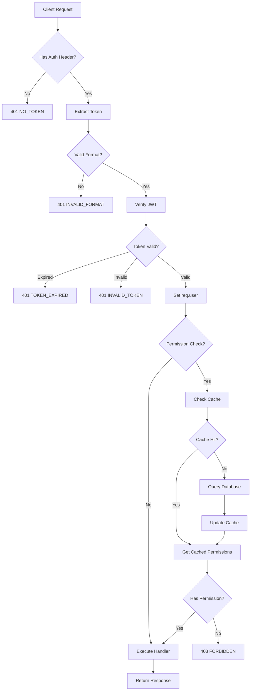

## 缓存机制

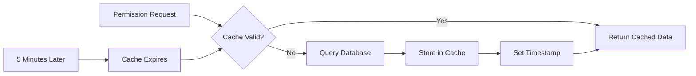

## 数据库关系

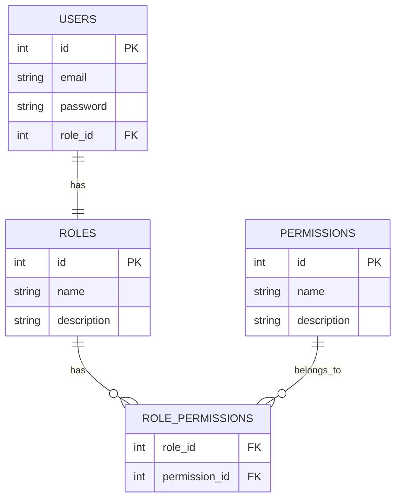

## 中间件链

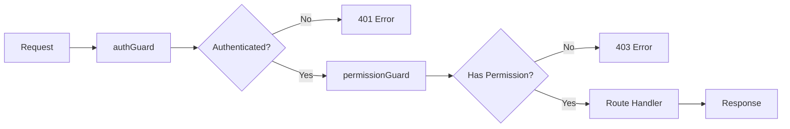

## 角色权限映射

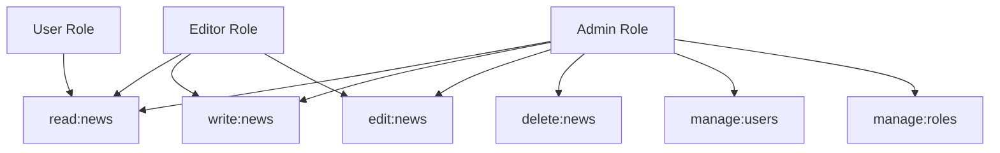

## 使用场景示例

### 场景 1: 公开访问
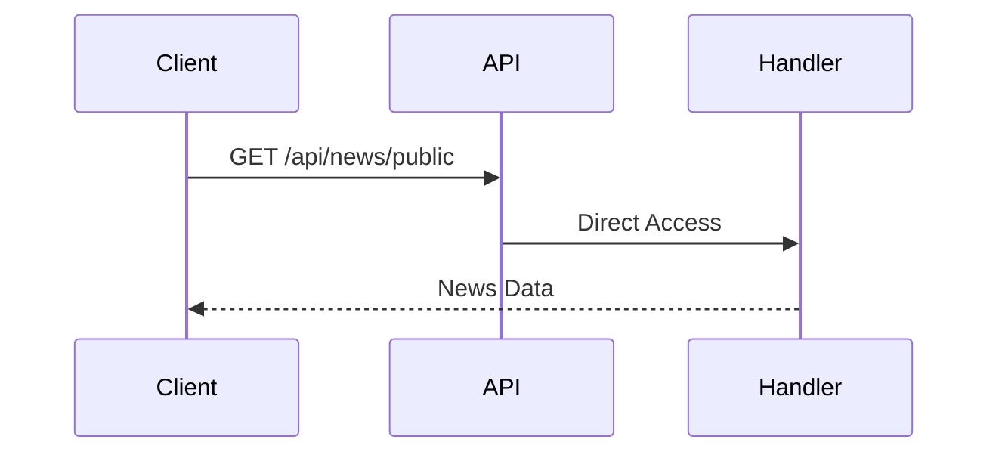

### 场景 2: 需要认证
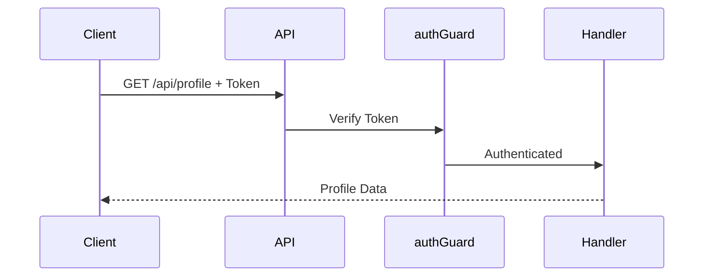

### 场景 3: 需要权限
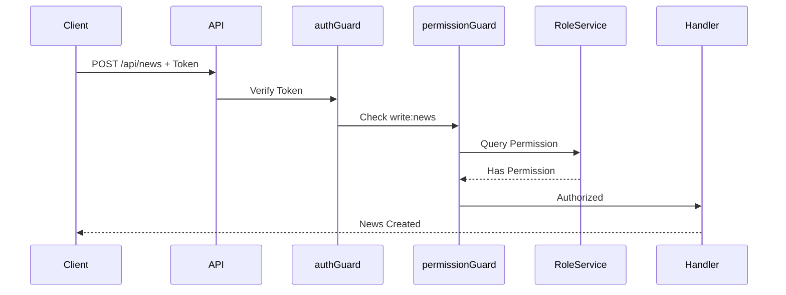

### 场景 4: 权限不足
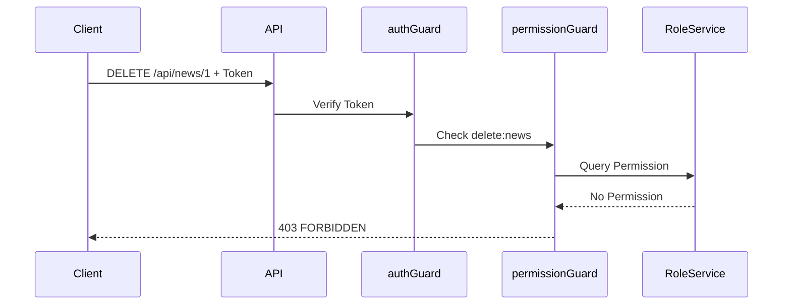

## 错误处理流程

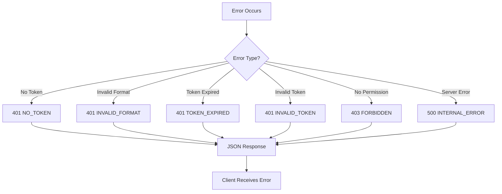

## 性能优化

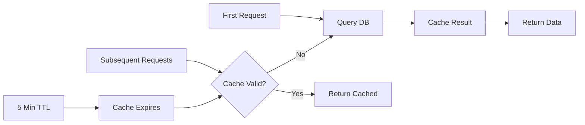

## 总结

这些流程图展示了:
1. **认证流程**: JWT token 验证和错误处理
2. **权限验证**: 缓存机制和数据库查询
3. **完整流程**: 从请求到响应的完整路径
4. **缓存机制**: 性能优化策略
5. **数据库关系**: RBAC 数据模型
6. **使用场景**: 不同访问级别的实际应用
7. **错误处理**: 各种错误情况的处理流程
